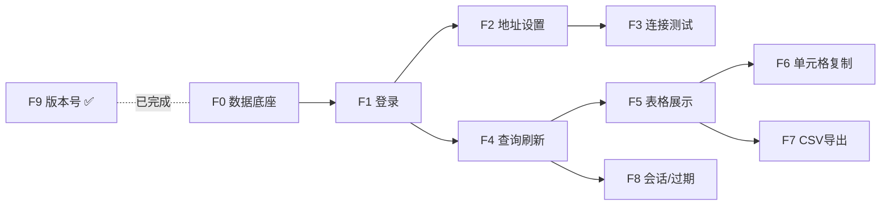

 

## 一、按功能划分的模块清单

**F0 是共享底座**（不属于任何单一功能，但 F1–F7 全都依赖它，必须先做）。

| 模块                | 用户可感知的功能             | 涉及的代码（跨层）                                                                                                                                         | 依赖               |
| ----------------- | -------------------- | ------------------------------------------------------------------------------------------------------------------------------------------------- | ---------------- |
| **F0 数据底座**       | 无界面                  | `Models/StockDiff.cs`、`Models/ApiResponses.cs`、`Table/TableColumns.cs`、`Convert/Converters.cs`、`Api/ApiExceptions.cs`、`Api/NetworkErrorMapper.cs` | AppConfig（已完成）   |
| **F1 登录认证**       | 输入账号密码→进入主界面         | `Views/LoginView.cs`、`ApiClient.LoginAsync`、`MainForm.ShowLogin/ShowDashboard`                                                                    | F0、MainForm（已完成） |
| **F2 接口地址设置与持久化** | 改接口地址、重启后仍生效         | `Dialogs/SettingsForm.cs`、`Settings/AppSettings.cs`                                                                                               | F1（需从登录页进入）（已完成） |
| **F3 连接测试**       | 点「测试连接」得到成功/失败提示     | `ApiClient.TestConnectionAsync`、LoginView 按钮                                                                                                      | F2（需先能改地址）       |
| **F4 数据查询与刷新**    | 选仓库/对比项→点刷新→拿到数据；可中断 | `ApiClient.FetchStockDiffAsync`、`Views/DashboardView.cs`（筛选栏+刷新）                                                                                  | F0、F1            |
| **F5 数据表格展示**     | 12 列表格、记录数、右对齐差异数量   | `DashboardView`（DataGridView）                                                                                                                     | F4               |
| **F6 单元格复制**      | 点单元格→内容进剪贴板          | `DashboardView`（CellClick）                                                                                                                        | F5               |
| **F7 CSV 导出**     | 导出文件、Excel 打开中文正常    | `Export/CsvExporter.cs`、`DashboardView`（导出按钮）                                                                                                     | F5               |
| **F8 会话管理**       | 退出登录、登录过期自动回登录页      | `DashboardView.PerformLogout`、401 处理                                                                                                              | F4（401 由拉数据触发）   |
| **F9 版本号展示**      | 标题栏显示 v1.2.2         | `AppConfig.Version`、`MainForm`                                                                                                                    | ✅ **已完成**        |

**依赖链（有向）**

### 当前实现状态（2026-09-20 对照源码核对）

> **路径说明**：本文档正文中的 `src/APP/...` 为简写，磁盘上的真实目录是 **`src/App/`**。
> Windows 文件系统不区分大小写故当前可编译，但接入 Linux CI / 容器构建后会直接失败，一律以 `src/App/` 为准。

| 模块            | 状态    | 已落地 / 缺口                                                                                                                                                                           |
| ------------- | ----- | ---------------------------------------------------------------------------------------------------------------------------------------------------------------------------------- |
| F0 数据底座       | ✅ 已完成 | `Models/StockDiff.cs`、`Models/ApiResponses.cs`、`Convert/Converters.cs`、`Table/TableColumns.cs`、`Api/ApiExceptions.cs`、`Api/NetworkErrorMapper.cs`，对应 5 个测试类                        |
| F1 登录认证       | ✅ 已完成 | `Settings/AppSettings.cs`、`Api/ApiClient.cs`（仅登录部分）、`Views/LoginView.cs`、`Views/DashboardView.cs`（占位）；`MainForm.cs` 已接入 `ShowLogin`/`ShowDashboard` 切换，对应 `ApiClientTests`（10 个用例） |
| F2 接口地址设置与持久化 | ✅ 已完成 | `Dialogs/SettingsForm.cs`、`Settings/AppSettings.cs`、登录页「API 设置」入口；改地址→落盘→`ClearToken()` 闭环                                                                                                                                                        |
| F3 连接测试       | ☐ 未开始 | 缺 `ApiClient.TestConnectionAsync`                                                                                                                                                  |
| F4 数据查询与刷新    | ☐ 未开始 | 缺 `ApiClient.FetchStockDiffAsync`、`Views/DashboardView.cs`                                                                                                                         |
| F5 数据表格展示     | ☐ 未开始 | 依赖 F4 的 `DashboardView`                                                                                                                                                            |
| F6 单元格复制      | ☐ 未开始 | 依赖 F5                                                                                                                                                                              |
| F7 CSV 导出     | ☐ 未开始 | 缺 `Export/CsvExporter.cs`（该目录当前仅存 `.gitkeep`）                                                                                                                                      |
| F8 会话管理       | ☐ 未开始 | 缺 `DashboardView` / `MainForm` 接线                                                                                                                                                  |
| F9 版本号展示      | ✅ 已完成 | `AppConfig.Version` + `MainForm` 标题                                                                                                                                                |

**当前可验证项**：`\scripts\test.ps1`（Core 层 6 个测试类，F1 新增 `ApiClientTests` 10 个用例）；`\scripts\dev.ps1` 可进入登录页，用真账号 `000/0000` 登录后进入主面板占位页。
**已完成提醒**：`AppSettings` 落盘已按「写 `settings.json.tmp` → `File.Move(overwrite: true)`」原子写实现；读取失败（`IOException` / `JsonException` / `UnauthorizedAccessException`）静默降级为默认地址。

## 二、按模块逐步开发的具体做法

每个模块走同一套循环：**写 Core（若有）→ 写 UI → 写单测 → 跑** **`.\scripts\test.ps1`** **→ 手动验界面 → 停下确认**。

| 步  | 模块     | 本步交付代码                                                                                                                                                | 自测方式                                                         |
| -- | ------ | ----------------------------------------------------------------------------------------------------------------------------------------------------- | ------------------------------------------------------------ |
| 1  | **F0** | `StockDiff.cs`、`ApiResponses.cs`、`Converters.cs`、`TableColumns.cs`、`ApiExceptions.cs`、`NetworkErrorMapper.cs` + `ConvertersTests`/`TableColumnsTests` | `test.ps1` 全绿；重点验「右对齐列有且仅有差异数量」、大数精度                         |
| 2  | **F1** | `LoginView.cs`、`ApiClient`（登录部分）、`MainForm` 加导航                                                                                                       | 用真账号 `000/0000` 登录，能进主界面；密码框掩码、按钮防重入                         |
| 3  | **F2** | `AppSettings.cs`、`SettingsForm.cs`                                                                                                                    | 改地址→关闭程序→重启，地址仍生效（查 `%AppData%\kc-stock-diff\settings.json`） |
| 4  | **F3** | `ApiClient.TestConnectionAsync`                                                                                                                       | 填对地址→「✓ 连接成功」；填错端口→提示拒连建议                                    |
| 5  | **F4** | `ApiClient.FetchStockDiffAsync` + DashboardView 筛选栏/刷新按钮                                                                                              | 切换仓库/对比项，状态栏与计数变化；刷新中途再点刷新，旧请求被丢弃                            |
| 6  | **F5** | DashboardView 的 DataGridView                                                                                                                          | 12 列顺序宽度正确、差异数量右对齐、表格只读                                      |
| 7  | **F6** | 单元格 Click                                                                                                                                             | 点带值单元格→粘贴到记事本一致                                              |
| 8  | **F7** | `CsvExporter.cs` + `CsvExporterTests` + 导出按钮                                                                                                          | Excel 打开无乱码、无全空列                                             |
| 9  | **F8** | `PerformLogout` + 401 分支                                                                                                                              | 点退出回登录页；拿过期 token 验证自动跳回                                     |
| 10 | **F9** | —                                                                                                                                                     | 已完成                                                          |

**建议**：F4+F5 是最重的一步（异步+取消+表格），可先只做「静态假数据填 12 列」，确认渲染无误后再接真接口，降低一次改动量。

## 三、两种推进路线对比

|   | **功能路线（本次提议）**   | **分层路线（原 T1–T10）** |
| ------ | ---------------- | ------------------ |
| 切法     | 纵向切片，每步端到端可用     | 横向，先全部 Core 再全部 UI |
| 早期可见成果 | 快（第 2 步就能登录）     | 慢（T1–T5 都没有界面）     |
| 单测覆盖   | 随功能增量补           | 集中在 T2–T4 一次补齐     |
| 返工风险   | 变更接口时需回头改已完成的 UI | Core 定型后再写 UI，返工少  |
| 适合     | 需要频繁看到效果、边做边调    | 契约已冻结、追求一次成型       |

## 一处次序修正（先声明，避免后面对不上）

我上一轮的 F2 含 `AppSettings.cs`，但 **`MainForm`** **在启动时就需要读持久化地址来构造** **`ApiClient`**，所以 `AppSettings` 必须提前到 F1。调整后：

| 模块 | 原计划内容                       | 修正后                                          |
| -- | --------------------------- | -------------------------------------------- |
| F1 | LoginView + LoginAsync + 导航 | **+** **`AppSettings.cs`（Load / 读写落盘）**      |
| F2 | AppSettings + SettingsForm  | **仅** **`SettingsForm`** **+ 登录页「API 设置」入口** |

***

## F0 — 数据底座（无界面，可完整单测）

| 任务    | 新建文件                                                 | 内容要点                                                                                                                       | 验收                  |
| ----- | ---------------------------------------------------- | -------------------------------------------------------------------------------------------------------------------------- | ------------------- |
| F0-1  | `src/Core/Models/StockDiff.cs`                       | 12 字段 + `[JsonPropertyName]`；`WarehouseQty`/`WmsQty`/`QtyDiff` 用 `JsonElement`；`DiffType` 容缺省空串；**不映射** **`wms_location`** | 编译通过；数量字段非 `double` |
| F0-2  | `src/Core/Models/ApiResponses.cs`                    | `LoginResponse`/`LoginData`/`StockDiffResponse`                                                                            | 编译通过                |
| F0-3  | `src/Core/Convert/Converters.cs`                     | `WarehouseLabelFromCode`、`WarehouseCodeFromLabel`、`NumberToString`                                                         | 未知/空 → 「全部」         |
| F0-4  | `src/Core/Table/TableColumns.cs`                     | `ColumnAlign`、`TableColumn` record、`Columns`（12 列按序）、`Headers()`、`Align(int)`、`CellValue(StockDiff,int)`                   | 列数=12；右对齐仅「差异数量」    |
| F0-5  | `src/Core/Api/ApiExceptions.cs`                      | `UnauthorizedException`、`ApiException`                                                                                     | 编译通过                |
| F0-6  | `src/Core/Api/NetworkErrorMapper.cs`                 | 超时/拒连/DNS/URL → 带「💡 排查建议」文案                                                                                               | 5 类分支各命中            |
| F0-7  | `tests/Core.Tests/ConvertersTests.cs`                | 各分支 + 反向 + `NumberToString` 空/数字/字符串                                                                                       | 全绿                  |
| F0-8  | `tests/Core.Tests/TableColumnsTests.cs`              | 12 列名与宽度按序；`CellValue` 与定义一致；右对齐唯一性                                                                                        | 全绿                  |
| F0-9  | `tests/Core.Tests/AppConfigTests.cs`                 | `NormalizeBaseUrl` 空/空格/null → 默认；带空格被 Trim                                                                                | 全绿                  |
| F0-10 | 删除 `Models/`、`Api/`、`Convert/`、`Table/` 下 `.gitkeep` | 有文件即不需占位                                                                                                                   | `git status` 干净     |

**验证**：`.\scripts\test.ps1` 预期 5 + 新增约 15 个用例全绿。

***

## F1 — 登录认证（首个可见界面）· ✅ 已完成

> **完成说明（2026-09-21）**：已按上文「次序修正」落地。实际新建 `src/App/Settings/AppSettings.cs`、`src/Core/Api/ApiClient.cs`（仅登录部分）、`src/App/Views/LoginView.cs`、`src/App/Views/DashboardView.cs`（占位）与 `tests/Core.Tests/ApiClientTests.cs`；修改 `src/App/MainForm.cs`、`src/Core/StockDiff.Core.csproj`（新增 `InternalsVisibleTo("Core.Tests")`）。
>
> **范围边界**：登录页「测试连接」「API 设置」在 F1 为**可点击占位**，点击仅提示「功能将在后续版本提供」，真实逻辑仍分别归 F3 / F2；`ApiClient` 的 `TestConnectionAsync` / `FetchStockDiffAsync` 尚未实施。
>
> **样式说明**：登录页为浅色现代卡片风。深色玻璃拟态（Glassmorphism）方案曾评估但**未实施**。

| 任务   | 文件                                   | 新建/修改 | 内容要点                                                                                                                                                                          |
| ---- | ------------------------------------ | ----- | ----------------------------------------------------------------------------------------------------------------------------------------------------------------------------- |
| F1-1 | `src/APP/Settings/AppSettings.cs`    | 新建    | `Dir`/`File` 指向 `%AppData%\kc-stock-diff\settings.json`；`BaseUrl` get/set 即落盘；`Load()`                                                                                        |
| F1-2 | `src/Core/Api/ApiClient.cs`          | 新建    | 静态 `HttpClient`（无全局超时）；`lock(_lock)`；`BaseUrl`/`Token`/`SetToken`/`ClearToken`/`ClearTokenIf`；`FullUrl`；`LoginAsync`；**`internal`** **注入** **`HttpMessageHandler`** **的构造函数** |
| F1-3 | `src/APP/Views/LoginView.cs`         | 新建    | 接口地址 Label、API 设置按钮（占位）、账号/密码（`UseSystemPasswordChar`）、测试连接（占位）、登录系统、状态 Label；卡片居中                                                                                            |
| F1-4 | `src/APP/MainForm.cs`                | 修改    | 持有唯一 `ApiClient`；`ShowLogin()` / `ShowDashboard(username)`；启动 `AppSettings.Load()`                                                                                            |
| F1-5 | `tests/Core.Tests/ApiClientTests.cs` | 新建    | stub handler：登录成功 / 非 0 码 / 无 token / 空入参 `ArgumentException` / HTTP 非 200                                                                                                    |
| F1-6 | 删除 `Settings/`、`Views/` 下 `.gitkeep` | —     | —                                                                                                                                                                             |

**验收**：真账号 `000/0000` 登录成功→切到主界面（空白 DashboardView 占位）；密码框掩码；登录中按钮禁用；失败弹 `MessageBox` 且按钮恢复。

> **注意**：F1 的 `ShowDashboard` 尚无 `DashboardView`，需先建一个最小空 UserControl 占位，F4 再填充。

***

## F2 — 接口地址设置与持久化 · ✅ 已完成

| 任务   | 文件                                | 新建/修改 | 内容要点                                                                                                   |
| ---- | --------------------------------- | ----- | ------------------------------------------------------------------------------------------------------ |
| F2-1 | `src/APP/Dialogs/SettingsForm.cs` | 新建    | 预填 `client.BaseUrl`；提示「修改后需重新登录」；确定→`NormalizeBaseUrl`→落盘→`ClearToken()`→`Saved=true`；取消→`Saved=false` |
| F2-2 | `src/APP/Views/LoginView.cs`      | 修改    | 「API 设置」按钮接线；`Saved` 为真时刷新地址 Label                                                                     |
| F2-3 | 收口方法 `SetBaseUrl(client, raw)`    | 新建/修改 | 登录、测试连接、设置对话框三处统一走它（赋值即落盘）                                                                             |

**验收**：改地址 → 关闭程序 → 重启，`settings.json` 值保留且地址 Label 更新。

***

## F3 — 连接测试

| 任务   | 文件                                       | 内容要点                                                                                               |
| ---- | ---------------------------------------- | -------------------------------------------------------------------------------------------------- |
| F3-1 | `src/Core/Api/ApiClient.cs`（修改）          | `TestConnectionAsync`：解析 host；无端口按 scheme 补 `:443`/`:80`；`TcpClient.ConnectAsync` + 5s 超时；失败抛带建议异常 |
| F3-2 | `src/APP/Views/LoginView.cs`（修改）         | 「测试连接」按钮接线：禁用→提示→成功/失败两路                                                                           |
| F3-3 | `tests/Core.Tests/ApiClientTests.cs`（修改） | 用 `TcpListener` 本机端口验证连通/拒连                                                                        |

**验收**：填对地址→「✓ 连接成功」+ 弹窗；填错端口→「连接被拒绝」建议文案。

***

## F4 — 数据查询与刷新（最重的一步）

| 任务   | 文件                                       | 内容要点                                                                                                                                                                                                                             |
| ---- | ---------------------------------------- | -------------------------------------------------------------------------------------------------------------------------------------------------------------------------------------------------------------------------------- |
| F4-1 | `src/Core/Api/ApiClient.cs`（修改）          | `FetchStockDiffAsync`：快照 token→空则「请先登录」；`warehouse` 空→`all`；query 带 `warehouse`/`compare_hold`/`compare_expiry`（小写 bool）；`Authorization: Bearer`；401→`ClearTokenIf(快照)`+`UnauthorizedException`；业务 401/403 或 message 含 token 同处理 |
| F4-2 | `src/APP/Views/DashboardView.cs`         | 新建：`SplitContainer`（20%）；左栏用户名、仓库 3 单选（默认全部）、对比 2 复选、底部 BaseUrl/设置/退出登录/版本号；右栏标题、statusLabel、导出（禁用）、刷新、DataGridView、计数 Label                                                                                                     |
| F4-3 | `src/APP/Views/DashboardView.cs`         | 刷新事件：UI 线程快照→`Cancel()` 旧 CTS→新 CTS→禁用按钮→`await`→**结果过期则丢弃**→填表→计数/状态→启用导出                                                                                                                                                       |
| F4-4 | `src/APP/Views/DashboardView.cs`         | 异常分支：`OperationCanceledException` 静默；`UnauthorizedException`→跳登录；其它→弹窗且旧数据仍可导出；`finally` 恢复按钮                                                                                                                                    |
| F4-5 | `src/APP/MainForm.cs`（修改）                | `ShowDashboard` 装载真实 `DashboardView`，注入 `ApiClient` 与用户名                                                                                                                                                                         |
| F4-6 | `tests/Core.Tests/ApiClientTests.cs`（修改） | 拉数据成功 / 401 抛异常且清 token / 大整数 `GetRawText` 不变形                                                                                                                                                                                   |

**验收**：切换仓库/对比项→刷新→计数与状态更新；连点刷新，前一次结果不覆盖后一次；接口断开时弹错误而旧数据仍在。

***

## F5 — 数据表格展示

| 任务   | 文件                                   | 内容要点                                                                                  |
| ---- | ------------------------------------ | ------------------------------------------------------------------------------------- |
| F5-1 | `src/APP/Views/DashboardView.cs`（修改） | DataGridView 配置：只读、禁增删行、禁调行高、无行头、`CellSelect`、非多选、`AutoSizeColumnsMode=None`          |
| F5-2 | 同上                                   | 逐列添加并按 `TableColumns.Columns` 设宽度；表头加粗居中；「差异数量」`MiddleRight`，其余 `MiddleLeft`          |
| F5-3 | 同上                                   | `PopulateGrid`：不用 `DataSource`，按 `TableColumns.CellValue(row, j)` 逐格 `Rows.Add`；空数据提示 |

**验收**：12 列顺序/宽度正确、差异数量右对齐、表格不可编辑、记录数正确。

***

## F6 — 单元格复制

| 任务   | 文件                                   | 内容要点                                                    |
| ---- | ------------------------------------ | ------------------------------------------------------- |
| F6-1 | `src/APP/Views/DashboardView.cs`（修改） | `CellClick`：值非空→`Clipboard.SetText`→状态栏「已复制: xxx」；空值不动作 |

**验收**：点带值单元格→粘贴内容一致；点空单元格无提示。

***

## F7 — CSV 导出

| 任务   | 文件                                     | 内容要点                                                                                                                |                                     |
| ---- | -------------------------------------- | ------------------------------------------------------------------------------------------------------------------- | :--------------------------------------- |
| F7-1 | `src/Core/Export/CsvExporter.cs`       | 新建：`Write(Stream, rows)`（UTF-8 **BOM**、表头/数据全由 `TableColumns` 派生、过滤全空列、全空时保留全部列、RFC 4180 转义）；`BuildDefaultFileName` |                                     |
| F7-2 | `tests/Core.Tests/CsvExporterTests.cs` | 新建：BOM 存在 / 空列被过滤 / 全空保留 / 逗号引号转义                                                                                   |                                     |
| F7-3 | `src/APP/Views/DashboardView.cs`（修改）   | 导出按钮：`SaveFileDialog`（Filter=\`CSV 文件                                                                               | \*.csv`，默认名）→`File.Create`→`Write\`→成功弹窗 |

**验收**：Excel 打开中文不乱码、无全空列；`test.ps1` 该测试类全绿。

***

## F8 — 会话管理

| 任务   | 文件                                   | 内容要点                                                                              |
| ---- | ------------------------------------ | --------------------------------------------------------------------------------- |
| F8-1 | `src/APP/Views/DashboardView.cs`（修改） | `PerformLogout(msg)`：取消 CTS→`ClearToken()`→弹窗→`ShowLogin()`                       |
| F8-2 | 同上                                   | 左栏「设置」按钮：`SettingsForm.ShowDialog()`，`Saved` 为真→`PerformLogout("接口地址已更新，请重新登录。")` |
| F8-3 | 同上                                   | `Dispose` 中 `_refreshCts?.Cancel()`，防关闭后回调                                        |
| F8-4 | `src/APP/MainForm.cs`（修改）            | 退出登录接线；401 自动回登录页                                                                 |

**验收**：退出→回登录页且 token 清空；用过期的 token 触发 401→自动跳登录页。

***

## F9 — 版本号展示

✅ 已完成（`AppConfig.Version` + MainForm 标题已验为 v1.2.2）。

***

## 里程碑与确认点

| 里程碑          | 覆盖    | 可对外演示的能力      |
| ------------ | ----- | ------------- |
| M-A：F0       | 数据底座  | 全部单测通过（无界面）   |
| M-B：F1+F2+F3 | 认证与配置 | 改地址、登录、测试连接   |
| M-C：F4+F5    | 核心功能  | 拉数据并正确展示 12 列 |
| M-D：F6+F7+F8 | 完整体验  | 复制、导出、退出/过期   |

**每个模块完成后我会停下**，等你确认再进入下一个。建议每完成一个里程碑做一次 `git commit`。

## 全局约定（已定，勿需再议）

- 每个新文件带 `创建者: PlatyPus` / `创建时间: 2026-09-20` / `作用` 三要素注释头，语法按文件类型（`.cs` 用 `//`、CSProj/manifest 用 `<!-- -->`、`.ps1` 用 `#`）
- 不新增文档文件；不写代码注释以外的多余内容
- `DefaultBaseUrl = http://127.0.0.1:7880`（文档值）
- Core 禁引用 `System.Windows.Forms`

